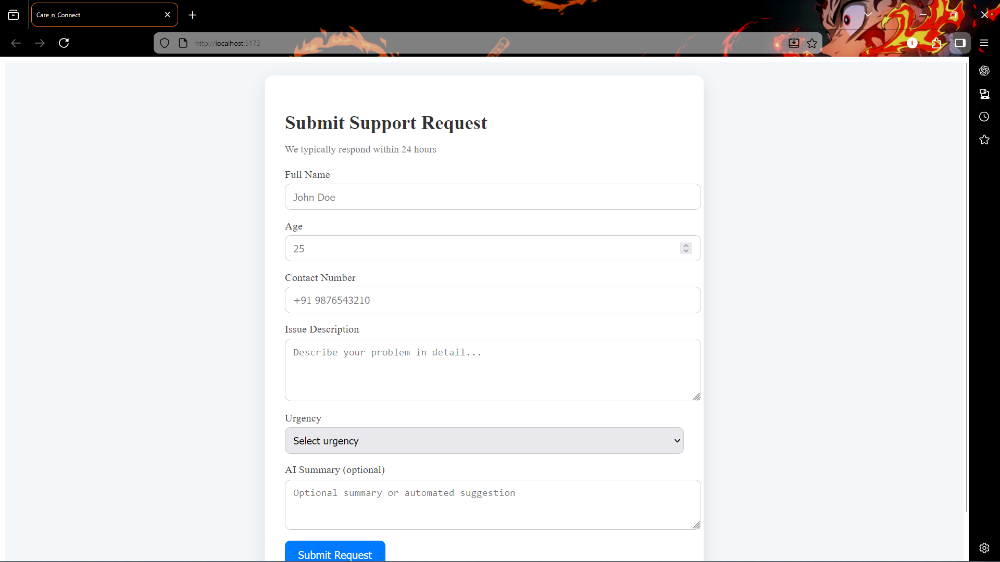
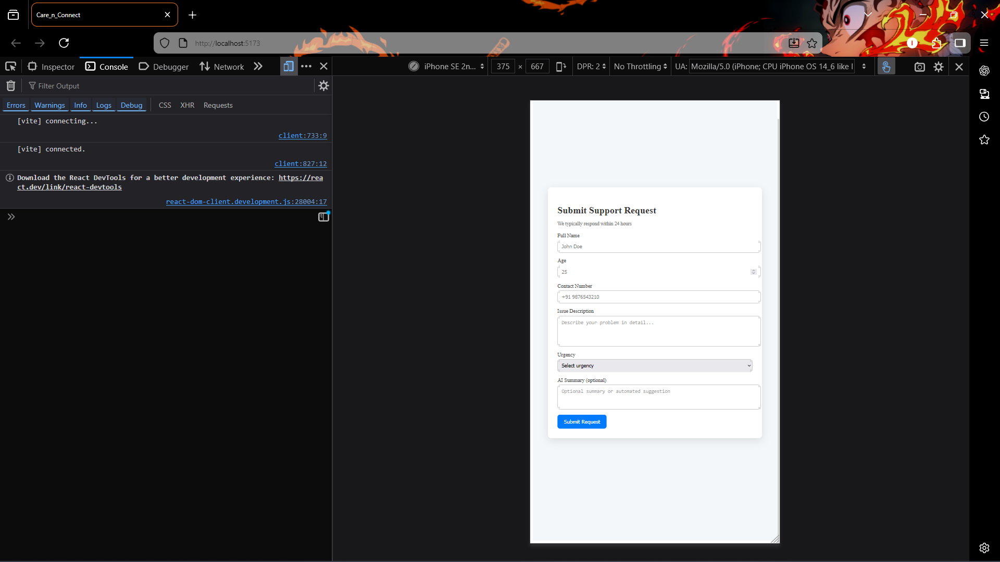
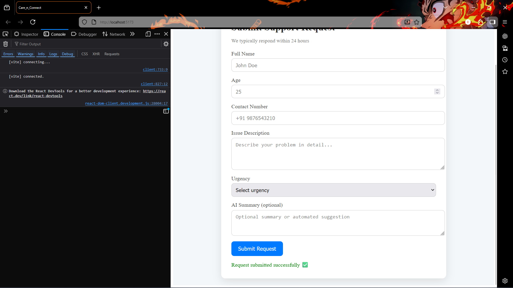

                                 Care_n_Connect – Mini Healthcare Support Web App

🏥 Project Overview:
Care_n_Connect is a simple healthcare support web app that allows patients or volunteers to submit requests for medical assistance, guidance, or general health support. This prototype demonstrates a full-stack MERN approach with a responsive, clean, and professional UI suitable for NGOs.

💻 Tech Stack

Frontend: React (Vite) + Axios + CSS

Backend: Node.js + Express.js (ES Modules)

Database: MongoDB Atlas

Automation/AI Idea: Auto-response system – each submission could trigger a confirmation message or summary for the NGO staff, streamlining communication.

🛠 Features

Responsive Form: Works on mobile, tablet, and large screens.

Full CRUD-ready backend: Captures requests and stores them in MongoDB.

Clear UI: Card layout, two-column fields on large screens, centered on all devices.

Form Validation: Ensures required fields are filled.

Loading Indicator: Button disables during submission.

Status Feedback: Displays success or error messages to the user.

🚀 How to Run
1. Backend

Navigate to the backend folder:
cd backend

Install dependencies:
npm install

Create a .env file with your MongoDB URI:
MONGO_URI=mongodb+srv://<username>:<password>@cluster0.mongodb.net/?retryWrites=true&w=majority

Start the server:
npm run dev

Server runs on http://localhost:5000

2. Frontend

Navigate to the frontend folder:
cd frontend

Install dependencies:
npm install

Start the frontend server:
npm run dev

Open http://localhost:5173 in your browser.

🤖 AI / Automation Idea

The app can implement a simple AI auto-response:

On form submission, the system sends a confirmation email to the patient or volunteer.

Additionally, it could summarize the request in a dashboard for NGO staff.

This reduces manual follow-up and ensures quicker response time.

🏛 NGO Use-Case

Patient Support: NGOs can collect healthcare requests and organize assistance.

Volunteer Registration: Volunteers can submit availability or expertise.

Centralized Data: MongoDB stores all requests, making it easy to track, filter, and manage submissions.

Scalable Prototype: Can be extended with AI triage, dashboards, or automated reminders.

### Screenshots

**Desktop View:**

**Mobile View:**

**Successfull message:**

